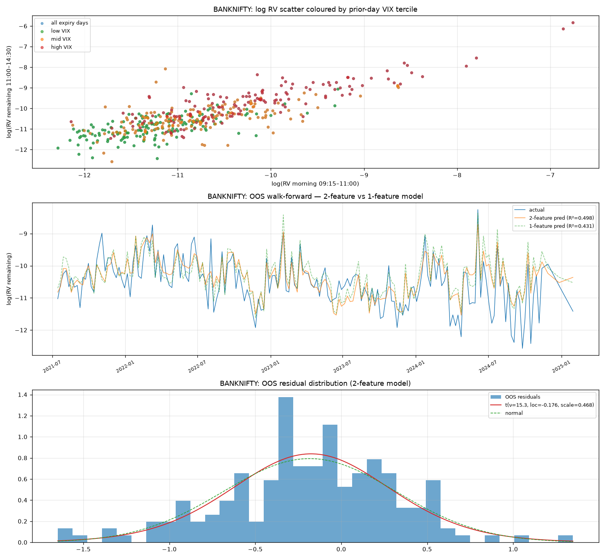
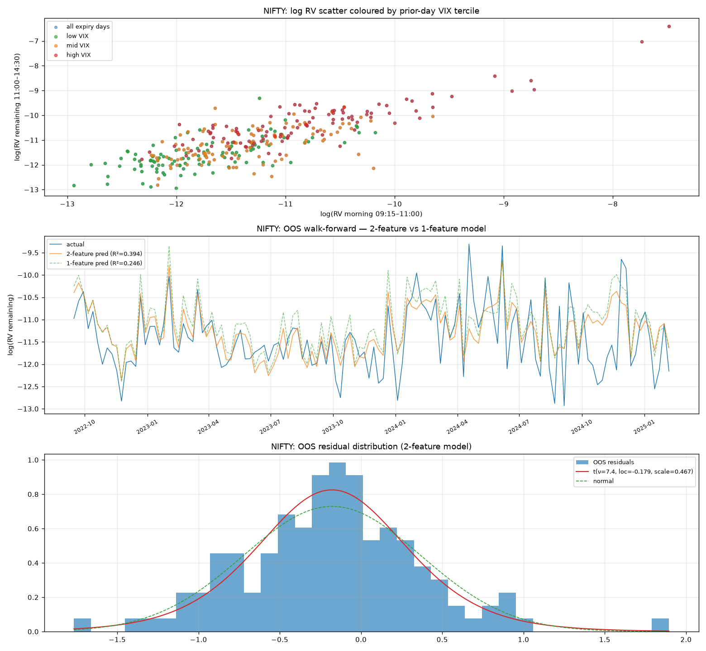

# nifty-0dte-vrp

**Two-feature log-linear model for remaining realized variance on NSE expiry days, used to size short strangle strikes on Nifty and BankNifty.**

---

## What this is

On expiry days, 0DTE options decay fast while the *remaining* realized volatility of the
underlying gets more predictable as the morning session unfolds. This repo asks one
narrow, well-posed question:

> Given only information available by late morning, how much price movement is actually
> left in the day — and how far away can you safely sell?

It's not a directional model and it doesn't touch the option chain. It forecasts
**remaining realized variance** from morning price action and the prior day's India VIX
close, fits the out-of-sample residuals to a Student-*t* distribution, and uses the
tails of that distribution to place statistically-grounded short strangle strikes.

The variance risk premium (VRP) shows up empirically, not by assumption: the fitted
residual distribution is systematically shifted negative, meaning the model's variance
forecast consistently overshoots what actually realizes. That gap is the edge.

Full derivation, methodology, and results: **[`vrp_note.pdf`](./vrp_note.pdf)**.

---

## Headline results

Walk-forward, expanding-window, out-of-sample. Nifty: 313 expiry days (2019–2025).
BankNifty: 445 expiry days (2016–2025).

| Model                     | Nifty OOS R² | BankNifty OOS R² |
|---------------------------|:------------:|:-----------------:|
| 1-feature (morning RV only) | 0.246      | 0.431              |
| **2-feature (RV + prior-day VIX)** | **0.394** | **0.498**   |

Adding the prior-day VIX close on top of morning realized variance alone is worth
**+0.148 R²** on Nifty and **+0.067** on BankNifty — the regime signal is genuinely
additive, not redundant with intraday price action.

A CatBoost sweep over 12 candidate features (multi-window RV, jump indicators,
time-of-day, prior expiry RV, etc.) confirmed that only these two features carry real
out-of-sample signal — everything else was noise. That's what motivates collapsing to a
closed-form, two-feature log-linear model instead of shipping a black box.

  
   <em>BankNifty — regime scatter, OOS walk-forward fit, and Student-t residual fit</em>

  
   <em>Nifty — regime scatter, OOS walk-forward fit, and Student-t residual fit</em>

Residual tails are heavier than normal in both indices (Nifty ν ≈ 7.4, BankNifty
ν ≈ 15.3) — a normal approximation would understate tail risk on exactly the days that
matter, which is why strikes are derived from a fitted Student-*t*, not a Gaussian.

---

## How strikes are set

1. At the 11:00 anchor, compute morning realized variance and pull the prior day's VIX close.
2. Forecast remaining realized variance to the 14:30 exit via the fitted log-linear model.
3. Map the desired tail probability through the fitted Student-*t* residual distribution
   to get a conditional quantile on remaining variance.
4. Convert that quantile to a return magnitude, and place the short strangle's put and
   call strikes at that distance from spot.
5. A hard floor overrides the model on abnormally quiet mornings, so the strategy never
   sells closer than a fixed minimum distance regardless of what the model says.

Full equations in the note. The point of the repo is the empirical validation, not a
black-box signal — every number above is walk-forward OOS, nothing is fit-and-reported
in-sample.

---

## What's here / what's not

- ✅ Full methodology write-up (`vrp_note.pdf`, `vrp_note.tex`)
- ✅ Scripts for feature selection, model fitting, and walk-forward validation
- ❌ No raw NSE data or India VIX series is included or redistributed — pull your own
  from your data vendor of choice and point the scripts at it
- ❌ No live execution, position sizing, or order routing — this is strike selection
  only, not a full trading system

---

## Disclaimer

This is a research framework, not investment advice or a production trading system.
It does not model execution costs, slippage, adverse selection, or margin/liquidation
risk on short options. Past out-of-sample performance on historical expiry days is not
a guarantee of future results. Use at your own risk.

---

## About

Built by [Aprameya](https://github.com/your-github-handle) — quantitative research on
NSE market microstructure and options. Questions, feedback, or spotted an issue in the
methodology? Open an issue or reach out.